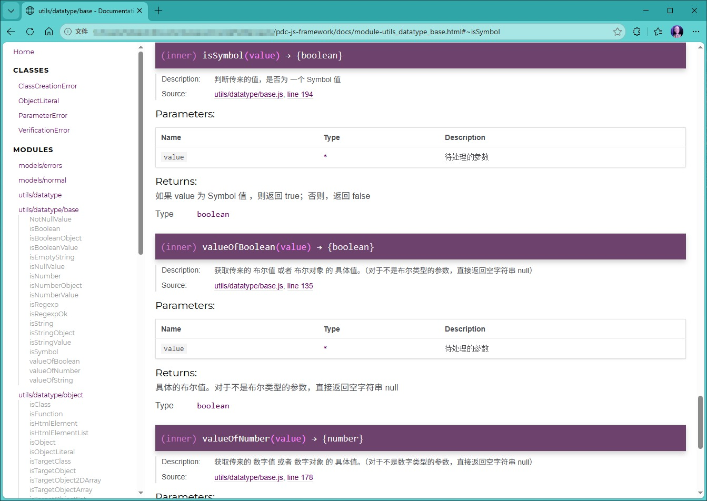

# 1. Introduction

This is an experimental JavaScript framework, which can also be called a toolkit. It's all programmed using ECMAScript 6+ syntax. The purpose of developing the framework is to make native JavaScript programming in the browser simpler and more object-oriented. Because during the design, modular handling was taken into account. So, the JavaScript modules in the utils folder inside the framework can run on their own and don't depend on other components. For version control, I usually use tags here. I don't recommend having multiple duplicate versions existing at the same time.

As for the overall idea of the code, it comes from another project of my own: <https://github.com/pdcGithub/my-mickarea-tool>. While working on another project, I found a lot of apis in native JavaScript that too complicated to use. So I wanted to tweak it and make some changes myself. The code for this project is mostly organized and migrated from another project, but it's not exactly the same.

> Note: The framework is intended for native JavaScript development in browsers, and it's not recommended to use it with NodeJS. This framework is still under development and gets updated from time to time.

> For the UI components, I'm using the Bootstrap 5 style files here. I'll update the instructions after the integration is done.

## 1.1 About data types

In my framework, the classification of data may differ from standard JavaScript. Please refer to the following description for details:

1. Empty (undefined, null, NaN): For these three data types, exceptions are likely to occur during program processing. So all are classified as empty. In standard Javascript, NaN is a numeric object.

```js
let a = undefined; let a2 = null; let a3 = NaN;
```

2. String: For string data, there are two possibilities, string value and string object.

```js
let s1 = '123'; let s2 = `123`; let s3 = new String('123');
```

3. Number: For numeric data, there are two possibilities, numeric value and numeric object.

```js
let n1 = 123; let n2 = new Number(123);
```

4. Boolean: For boolean data, there are two possibilities, boolean value and boolean object.

```js
let b1 = true; let b2 = false; let b3 = new Boolean(true); let b4 = new Boolean(false);
```

5. Regular Expression: For regular expression data, it only has one type that the regular expression object. It doesn't matter whether it is written in expression form or object form.

```js
let r1 = /123/; let r2 = new RegExp('123');
```

6. Symbol: It is a basic data type, not an object.

```js
let sy1 = Symbol("test1"); let sy2 = Symbol.for('test2');
```

7. Class: Classes in JavaScript are not independent like in other languages. In fact, they are functions. You can just use keyword `new` to create an object.

```js
class Test1 {}; let t1 = new Test1();
```

8. Function: According to standard JavaScript syntax, it has three types, named function, anonymous function, and arrow function.

```js
function testFunc1(){return 1+1}; let test2 = function(){return 1+1};  let test3 = ()=>{return 1+1};
```

9. Conventional collection object: In general, the commonly used collection objects are the following four types, Map, Set, one-dimensional array, two-dimensional array.

```js
// map
let m1 = new Map(); let m2 = new Map([['a', 1], ['b', 2]]);
// set
let st1 = new Set(); let st2 = new Set([1,2,3]);
// one-dimensional array
let a1 = [1, 2, 3]; let a11 = [];
// two-dimensional array
let a2 = [[1,2,3], [4,5,6]]; let a22 = [[]];
```

10. Conventional object: In general, the commonly used objects are the following, object literals , objects created by custom classes and objects created by the Object class.

```js
// object literal
let o1 = {}; let o2 = {a:1, b:2}; 
// object created by Object class.
let o3 = new Object();
// obejct created by custom class.
class MyTest {};
let o4 = new MyTest();
```

# 2. Folder Structure

Now, let me explain the meaning of each folder in this project. To minimize differences in usage caused by code organization, I designed an interface for each external module. You just need to call this interface file when using it.

```
├─demos  ( This is examples for demonstration purposes )
│      ......
│      
├─models (This is the model folder, used to store some custom models)
│  │  errors.js      (External exception-related model interface)
│  │  normal.js      (External normal model interface)
│  │  
│  ├─errors
│  │      ......     (Specific exception model class)
│  └─normal
│         ......     (Specific normal model class)
│          
├─tests  (This is an internal testing program)
│  │  testAll.html   (Test page that can call all modules)
│  │  testTools.js   (This is a test toolkit, only for testing within this framework, not recommended for external use)
│  │  
│  ├─models          
│  │      ......     (Specific test code, organized by module into folders)
│  │      
│  └─utils
│         ......     (Specific test code, organized by module into folders)
│              
├─thirdpartys  (These are some third-party modules, not yet organized)
│      ......
│      
├─uiComponents  (This is the framework's UI component, still under development)
│      ......
│      
└─utils  (These are some utility modules that can run independently of the framework, relying only on models)
    │  datatype.js      (External Interface of the Data Processing Module)
    │  html.js          (External interface of the HTML processing module)
    │  string.js        (External interface of the String processing module)
    │  valid.js         (External Interface of the Validation Processing Module)
    │  
    ├─datatype
    │      ......    (The specific implementation code, divided into folders by module)
    │      
    └─valid
           ......    (The specific implementation code, divided into folders by module)
```

# 3. How To Use

If you want to use this framework, you can just download it. I don't offer packing and compressing into a single file for now. The user can handle it on their own. Since it's based on the browser's native JavaScript syntax, these external modules can be integrated with any JavaScript framework.

## 3.1 Examples Of Importing A Module

Depending on your needs, you can import only the specified functions:

```js
import { myToString } from "../utils/string.js";
```

You can also import the entire module:

```js
import * as du from "../utils/datatype.js";
```

> When importing modules, make sure the file's relative path is correct.

## 3.2 Complete Examples

The demo code is written based on HTML and native JavaScript. When testing it, it's recommended to serve it over HTTP rather than running it locally via the file protocol. If you're using the VSCode editor, try using the Live Server extension. 

> A single-page example, with JavaScript embedded in the HTML: [demo1.html](/demos/demo1.html)

> A single-page example, with JavaScript in a separate file: [demo2.html](/demos/demo2.html) [demo2.js](/demos/demo2.js)

# 4. About Internationalization

Because I am an individual developer and currently do not have time to handle internationalization. Therefore, the code comments and exception descriptions will include Simplified Chinese.

# 5. About API Documentation

I suggest everyone use the `npm` tool to generate API docs. In the third-party libraries of `npm`, there’s a plugin called `JSDoc`. Generally speaking, when installing `NodeJS`, it comes with these three command-line tools: `node`, `npm`, and `npx`. As for installing dependencies, it is recommended to install them in the directory of this project, rather than globally. If you want to generate API documentation, you can refer to the following script:

```bash
# note: This is just an example, please fill in the command content according to the actual situation.

# 1. Clone project and jump into the folder of this project. 
git clone <this-repo-url>
cd this-project

# 2. Install all dependencies (install everything locally in node_modules)
npm install

# 3. Run jsdoc to generate API docs
npm run docs
```

After the command runs successfully, you'll see a folder named `docs`. Just find the `index.html` inside and open it with your browser. 

The browser interface you see may look like this:

